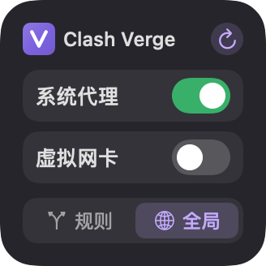
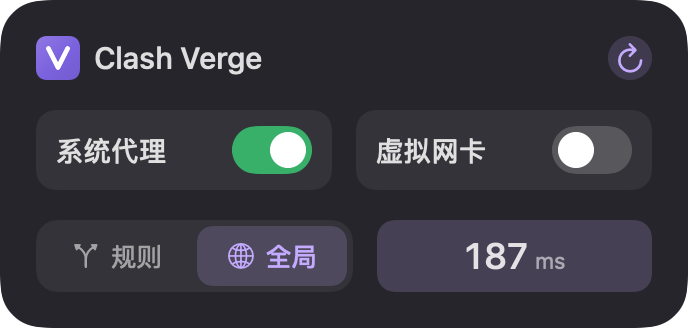
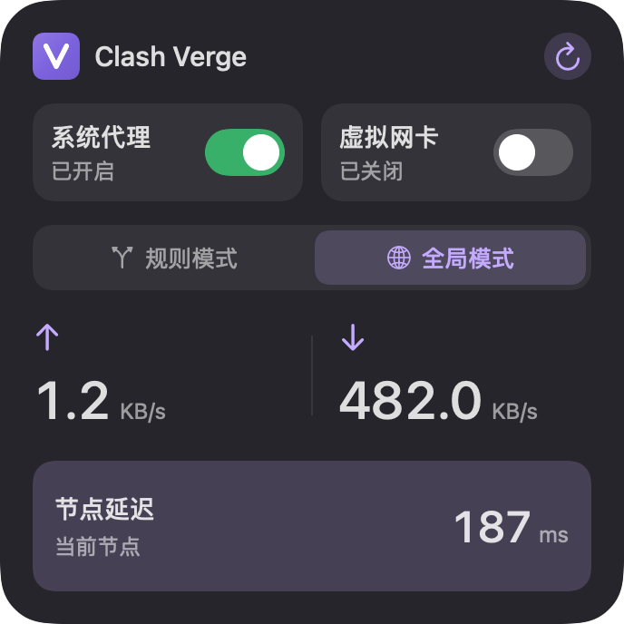

# Verge Card

macOS 原生 Clash Verge Rev 桌面控制小组件，支持小号、中号和大号。在桌面“编辑小组件”中添加，开关和测速直接在卡片上操作。

## 下载状态

首个公开测试版本为 **0.3.0 Beta 1（构建 19，流线 V 版）**，使用 Apple Development 开发签名，未经 Apple 公证。

[下载 ZIP（推荐）](https://github.com/GungnirRex/verge-card/releases/download/v0.3.0-beta.1/VergeCard-0.3.0-beta.1-macOS-arm64.zip) · [下载 HFS+ DMG](https://github.com/GungnirRex/verge-card/releases/download/v0.3.0-beta.1/VergeCard-0.3.0-beta.1-macOS-arm64-hfsplus.dmg) · [发布说明与校验文件](https://github.com/GungnirRex/verge-card/releases/tag/v0.3.0-beta.1)

本仓库公开安装包和使用说明，暂不公开源代码。Verge Card 为独立配套工具，不隶属于 Clash Verge Rev 项目，不提供 VPN 服务或订阅。

## 系统要求

- Apple 芯片 Mac，macOS 14 或更高版本；此包不支持 Intel Mac 或 iOS。
- 已安装并启动 Clash Verge Rev，并有可用配置。本工具不包含 Clash 本体或内核。
- 控制开关需要本人确认辅助功能授权；四个快捷键由 Verge Card 自动配置。

## 安装

请在待安装电脑的浏览器中从 GitHub Release 的 Assets 下载附件。公开安装包可直接下载，无需登录 GitHub；不要把聊天中的本机文件路径链接作为跨电脑下载入口。

1. 升级时先退出旧版 Verge Card（旧版从菜单栏退出，新版从设置页退出）（无需退出 Clash）。推荐下载 ZIP，双击解压，将“Verge Card”文件夹中的 **Verge Card.app** 拖入“应用程序”，从该文件夹首次打开。另提供文件名带 `hfsplus` 的 DMG，双击挂载后拖拽安装。
2. 此 Beta 使用 **Apple Development 开发签名，未经 Apple 公证**。若系统阻止打开，先尝试启动一次，再到“系统设置 → 隐私与安全性 → 仍要打开”确认。详情见 [Apple 说明](https://support.apple.com/102445)。无需关闭 Gatekeeper 或 SIP；受管理的 Mac 可能不允许此操作。
3. 确认页面顶部显示 **0.3.0 Beta（19）**；若仍是旧界面，请退出旧版后从应用程序打开新版。进入设置页即自动配置，再次进入或授权返回也会自动检查。按首次配置页检查 Clash 目录、选择规则模式主节点组，并在系统辅助功能中允许 Verge Card。返回后程序自动沿用有效热键，补齐缺失或冲突项并保存；无需逐项录入组合键。首次配置会短暂打开 Clash 热键设置，不切换代理、TUN、模式或节点。
4. 从下载目录、磁盘镜像或临时隔离路径启动时，应用会先提示用访达移入“应用程序”，不会进入后台配置。从正式位置首次启动或升级后，自动更新自身小组件登记，并退出现有同团队签名的 Verge Card 扩展以便系统重启。若图库仍缺失，在设置页点击“修复小组件”，再重新打开图库；不会重置系统图库或退出其他小组件。
5. 在桌面空白处右键 → 编辑小组件 → 搜索 **Verge Card**，添加任一尺寸。

若旧 DMG 提示“此电脑不能读取你连接的磁盘”，不要初始化，推出后改用 ZIP。新 DMG 已改用明确的 HFS+ 文件系统；ZIP 无需挂载磁盘。构建 17 修复测速交互注册与节点组保存，保留先前自动快捷键修复。构建 18 增加永久安装位置防护与自身登记修复，统一 Finder、设置页和三种卡片的紫色 Logo。构建 19 将 Logo 更新为已确认的流线 V，统一 Finder、设置页与三种卡片；底部为单一路径连续相接。2026-10-10，用户已确认完成构建 19 的另一台兼容 Mac 安装和真实桌面交互验收。校验清单覆盖 ZIP、新 DMG 与中文说明。

安装使用无须 Xcode 或 Apple 开发者账号。每台电脑的系统授权仍须本人确认，应用无法自动授予权限。自动配置当前按 Clash Verge Rev 的中文或英文热键界面适配；按行名称匹配四个输入框，等待窗口和输入焦点就绪；无法识别时停止并提示具体失败阶段。自动配置失败后无需手动录入，点击“自动配置并连接”重试。未完成引导时下次启动会自动继续。

## 功能与刷新

| 尺寸 | 内容 |
| --- | --- |
| 小号 | 系统代理、虚拟网卡、规则/全局；右上角测速，结果可在设置页查看，系统支持时也可悬停查看 |
| 中号 | 两个开关、模式选择、延迟数值；右上角测速 |
| 大号 | 两个开关、模式选择、节点与延迟、网速快照；右上角测速 |

右上角测速先读取真实状态，再测当前节点，完成后更新所有尺寸，不打开设置窗口。构建 17 的专用测速操作同时注册到主程序和扩展；规则模式优先沿用已选组，未保存或旧组失效时恢复 Proxy 或唯一组，多组不明确时提示选择。设置页选择节点组后立即保存，完成设置时再次核对。中号和大号首次显示“未测速”，失败显示简短原因；已有结果保留并标记异常。品牌入口打开设置。若系统没有悬停提示，可在设置页查看当前节点、最后一次测速时间和原因，并直接测试延迟。大号网速为采样时的快照，并非实时速度，设置页不再提供网速采样按钮。自动更新请求约每 30 分钟一次，实际时间由 macOS 决定。

应用不显示顶部状态栏图标。可点击小组件品牌区域或在“应用程序”中打开 Verge Card 进入设置；设置页提供“退出 Verge Card”。主程序需要在后台运行，以便响应小组件。关闭设置窗口不会退出；建议允许登录启动。空闲时不进行秒级轮询、不持续采集网速；在设置页退出 Verge Card 会使小组件失去控制连接，不会退出 Clash。

## 界面预览

以下为原生界面的示例数据渲染。

## Beta 限制与隐私

**验收记录（2026-10-10）：**构建 19 已通过 79 项隔离检查、Release 编译、主程序及扩展签名检查、ZIP 解压校验和 HFS+ DMG 实际只读挂载。Mac mini 已安装构建 19，后台只读测速为 174 ms，前后代理、TUN、模式及 Clash 进程未变化；三种尺寸的系统时间线加载成功。开发机 Clash Verge Rev 为 2.5.5。

用户已确认完成另一台兼容 Mac 的安装与真实桌面验收，范围包含首次安装、自动配置、三种尺寸添加、右上角测速、状态更新及组件管理。异机的具体 macOS、芯片型号和 Clash 版本尚未单独记录，因此不能推定所有兼容系统和 Clash 版本均已验证。

真实代理、TUN、规则/全局切换未验收；控制逻辑使用模拟端验证。此版本为 Pre-release，开发签名不等同于 Apple 公证，其他设备仍可能受系统或管理策略限制。反馈请提供系统版本、Clash 版本和错误提示，**不要上传订阅、密钥或完整 Clash 配置**。

配置与控制密钥留在主程序本机，未写入安装包或共享小组件缓存。无账号、遥测或 Verge Card 云端服务；测速通过本机 Clash 访问其配置的测速地址。详见 [隐私说明](PRIVACY.md) 和 [第三方许可](THIRD-PARTY-NOTICES.txt)。
